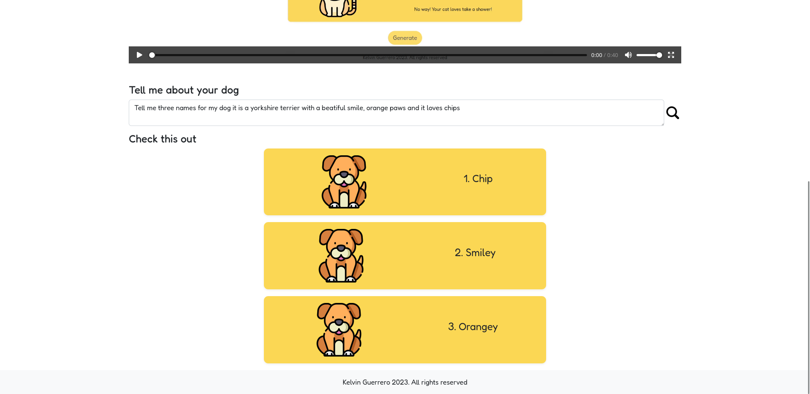

# app-petNameGenerator 🐶
## Description 📚
An app to generate 3 names passing a prompt to openAI API
## How Can I use it? 🤔
You have to describe your pet, do not delete the default prompt, you may write a **comma (,) or a whitespace** and describe your pet.

## How I Did it? 👨‍💻 
* HTML
* CSS (Bootstrap)
* JS 
### npm packages
* Node.js
* Express
* Ejs
* openai

## Visit Here 📲
[nameMyPet](https://quiet-sunset-9039.fly.dev/ "Name my Pet website")

## Examples
> Tell me three names for my dog, it is a yorkshire terrier with a beatiful smile, orange paws and it loves chips

